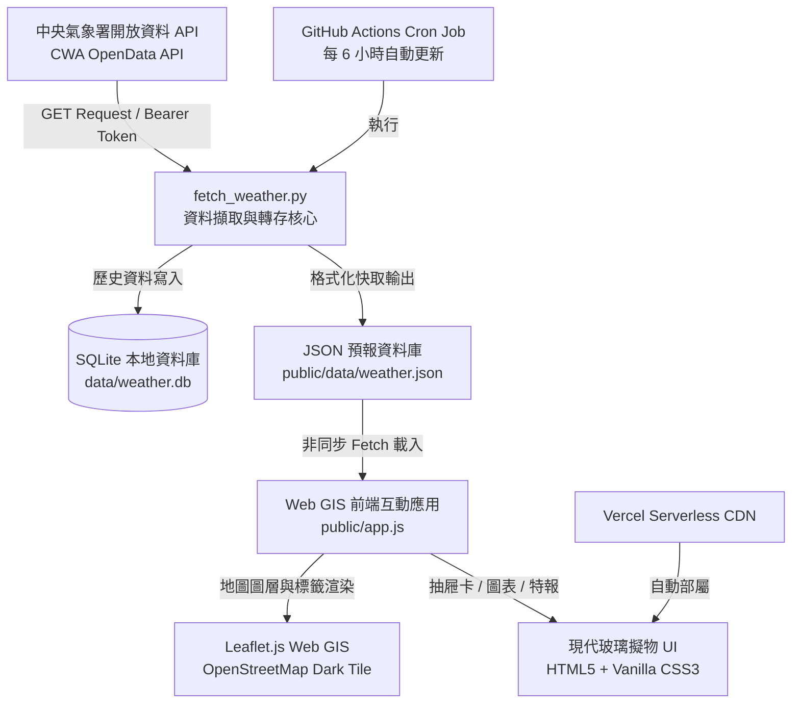

# 🌦️ 台灣中央氣象署 Web GIS 互動式天氣預報系統

[](https://github.com/wupinlai/Lesson-2/actions)
[](https://www.python.org/)
[](https://leafletjs.com/)
[](https://www.sqlite.org/)
[](https://vercel.com/)
[](https://opensource.org/licenses/MIT)

> 本專案為「人工智慧與資料安全」課程之單元二專案，結合 **中央氣象署 (CWA) 開放資料 API**、**SQLite 本地資料庫**、**GitHub Actions 自動化排程** 與 **Leaflet.js Web GIS 地圖視覺化**，打造兼具現代質感 (Glassmorphism)、高效能、資安隔離與響應式設計 (RWD) 的全台天氣預報視覺化平台。

---

## 🌟 專案核心功能與特色 (Features & Highlights)

### 🗺️ 1. 沉浸式 Web GIS 地圖視覺化
- **Leaflet.js 互動地圖**：以台灣全島為視野核心 (`[23.7, 121.0]`)，採用完全免 API Key 的 OpenStreetMap 底圖搭配客製化 CSS 矩陣濾鏡，呈現沉浸式賽博深色 (Cyber Ocean Dark) 質感。
- **自訂天氣氣泡標籤 (Custom Weather Markers)**：於全台 22 縣市地理中心直觀呈現即時天氣 Emoji、縣市名稱與預測氣溫區間，並依據降雨機率與高溫動態套用警戒色彩。
- **選取焦點光暈 (Active Highlight)**：點擊標籤或搜尋時，自動平移聚焦並產生流動光暈外框。

### 🕒 2. 36 小時預報與多時段動態切換
- **三時段無縫切換**：支援即時切換「今日午後」、「今晚至明晨」、「明日白天」等三時段，動態批次重繪全台 22 縣市標籤與統計數值。
- **視覺化趨勢圖表卡片**：於側邊抽屜卡中展示 36 小時趨勢，包含溫差區間與**色彩梯度降雨機率進度條**（<30% 翡翠綠、30~60% 天空藍、>60% 靛藍）。

### 🚨 3. 即時氣象警特報整合 (Weather Hazard Warning)
- **即時警報監測**：串接氣象署警特報 API，當有陸上強風、豪大雨或高溫特報時，頂部自動顯示呼吸光暈警示膠囊。
- **警特報詳細視窗 (Modal)**：點擊即可展開警報標題、說明內容及受影響之縣市標籤清單。

### 🔍 4. 智慧搜尋與全台分區快速切換
- **雙向容錯搜尋 (Search Autocomplete)**：支援即時搜尋縣市名稱（如輸入「台北」或「臺北」），附帶即時天氣與氣溫預覽下拉選單。
- **分區快速切換 (Region Chips)**：一鍵切換「全島 / 北部 / 中部 / 南部 / 東部 / 離島」，自動縮放至該區域最佳視野。

### 📊 5. 全台氣象統計儀表 (Statistics Bar)
- 自動即時計算全台平均氣溫、全島最高溫與最低溫縣市、以及降雨警戒縣市統計。

### 🛡️ 6. 企業級資料安全與 CI/CD 自動化
- **API Key 環境變數隔離**：金鑰透過 `.env` 管理，`.gitignore` 嚴格排除金鑰與資料庫檔案。
- **離線模擬回退機制**：若無 API 金鑰，系統自動啟用 22 縣市模擬數據生成器，確保展示零中斷。
- **GitHub Actions 排程更新**：配置每 6 小時定期自動執行 Python 爬蟲並同步快取。
- **Vercel 自動部署**：推送到 GitHub 即時觸發全球 CDN 靜態託管部署。

---

## 🏛️ 系統架構 (System Architecture)



---

## 📁 專案目錄結構 (Project Structure)

```text
.
├── .github/
│   └── workflows/
│       └── weather_cron.yml      # GitHub Actions 每 6 小時定時爬蟲排程
├── data/
│   ├── weather.db                # SQLite 本地預報資料庫 (已列入 .gitignore)
│   └── weather.json              # 22 縣市 36 小時預報與警特報 JSON 快取
├── public/                       # Vercel 部署根目錄
│   ├── data/
│   │   └── weather.json          # 前端讀取之預報快取 JSON
│   ├── app.js                    # Web GIS 核心邏輯 (Leaflet, 搜尋, 濾鏡, 抽屜卡)
│   ├── index.html                # 前端主介面 HTML5
│   ├── manifest.json             # PWA 漸進式網頁應用配置
│   └── style.css                 # 玻璃擬物深色主題 (Cyber Dark Glassmorphism)
├── .env                          # 本地 API 金鑰設定檔 (已忽略版控)
├── .env.example                  # 環境變數範本
├── .gitignore                    # Git 忽略清單 (排除 .env, .db 等敏感檔案)
├── DESIGN.md                     # 系統架構與設計指南
├── fetch_weather.py              # Python 自動化擷取、解析與轉存腳本
├── index.html                    # 根目錄入口 (本機直接預覽相容)
├── manifest.json                 # 根目錄 PWA 資訊
├── README.md                     # 專案完整說明文件
├── requirements.txt              # Python 相依套件清單 (requests, python-dotenv)
└── vercel.json                   # Vercel 雲端靜態託管設定檔
```

---

## 🛠️ 技術堆疊 (Tech Stack)

| 層級 | 技術 / 套件 | 說明 |
| :--- | :--- | :--- |
| **資料擷取層** | Python 3.10+, Requests, python-dotenv | 串接 CWA `F-C0032-001` 及 `W-C0033-001` API |
| **資料儲存層** | SQLite 3, JSON | 本地關聯式資料庫 `TemperatureForecasts` 及標準 JSON 輸出 |
| **地圖引擎** | Leaflet.js 1.9.4 | 座標定位、DivIcon 自訂天氣氣泡標記、動態 Popup |
| **前端設計** | HTML5, Vanilla CSS3 (Glassmorphism) | Google Fonts (Outfit & Inter), 響應式 RWD, 降雨進度條 |
| **前端邏輯** | Vanilla JavaScript (ES6+) | 異步 Fetch, 自動完成搜尋, 時段切換, 警報 Modal |
| **自動化 & 雲端**| GitHub Actions, Vercel | 定時 Cron 任務、Git Push 自動觸發全球 CDN 部署 |

---

## 🚀 快速上手 (Quick Start)

### 1. 複製儲存庫
```bash
git clone https://github.com/wupinlai/Lesson-2.git
cd Lesson-2
```

### 2. 安裝 Python 相依套件
```bash
pip install -r requirements.txt
```

### 3. 設定中央氣象署 API 金鑰
至 [中央氣象署氣象資料開放平台](https://opendata.cwa.gov.tw/) 註冊取得 API Key。
建立 `.env` 檔案並填入：
```env
CWA_API_KEY=你的中央氣象署API金鑰
CWA_API_URL=https://opendata.cwa.gov.tw/api/v1/rest/datastore/F-C0032-001
```
*(備註：若未填寫 API Key，系統將自動啟動 22 縣市逼真離線模擬數據模式，全功能皆可正常展示。)*

### 4. 執行資料擷取腳本
```bash
python fetch_weather.py
```
> 腳本將建立 SQLite 資料庫 `data/weather.db` 並同步產出 `public/data/weather.json`。

### 5. 啟動本機伺服器預覽
```bash
# 使用 Python 內建 HTTP 伺服器
python -m http.server 3000
```
開啟瀏覽器前往 **http://localhost:3000** 或 **http://localhost:3000/public/** 即可檢視完整互動地圖。

---

## 🌐 部署至 Vercel (Deployment)

1. 將代碼推送至 GitHub 儲存庫：
   ```bash
   git push origin main
   ```
2. 在 [Vercel](https://vercel.com/) 點擊 **Add New Project** 並匯入 `Lesson-2` 專案。
3. 於專案 **Settings → Environment Variables** 新增 `CWA_API_KEY`（選用）。
4. 點擊 **Deploy**，數秒內即可完成全球 CDN 部署發布！

---

## 📝 開發里程碑與維護總結 (Project Summary)

在本次專案開發中，我們完成了以下工作：
1. **資料層建立**：完成 `fetch_weather.py`，支援中央氣象署 36 小時預報 (`F-C0032-001`) 與警特報 (`W-C0033-001`) 雙重 API 抓取、SQLite 資料庫儲存與離線回退。
2. **Web GIS 介面升級**：建立免 API Key 之 OpenStreetMap 深色主題瓦片圖層，並設計 22 縣市氣象氣泡、即時 Popup 與側邊抽屜卡。
3. **視覺化與互動優化**：新增 36 小時時段切換、降雨機率漸層進度條圖表、全台分區快速跳轉、即時特報彈窗與容錯自動完成搜尋。
4. **全螢幕 RWD 調校**：針對電腦、平板與手機等不同螢幕尺寸進行完整排版優化。
5. **雲端自動化與修復**：配置 GitHub Actions 定時更新工作流，並修正 Vercel 部署設定 (`vercel.json`)。

---

## 📄 授權協議 (License)

本專案採用 [MIT License](LICENSE) 授權。氣象開放資料版權屬於中華民國交通部中央氣象署所有。
